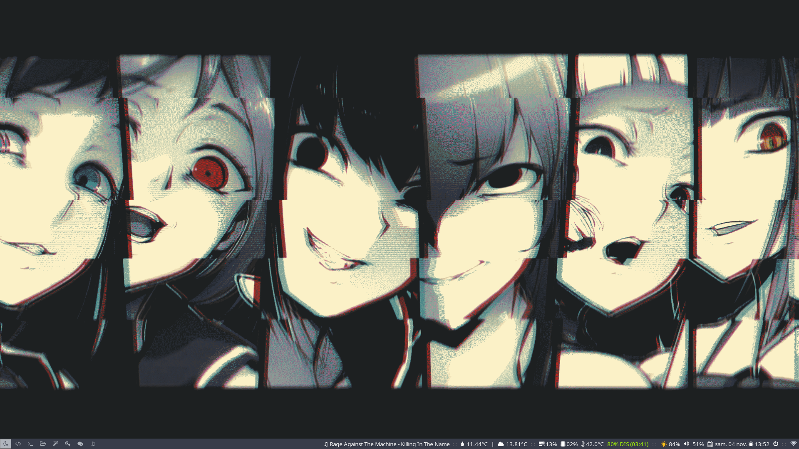
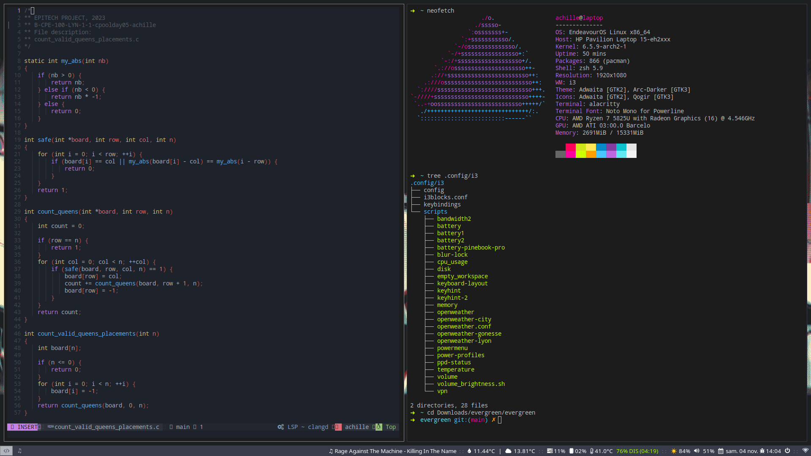

# My Arch Linux Dotfiles

This repository contains my personal configuration files for Arch Linux (EndeavourOS), tailored to my preferred setup :

- [EndeavourOS](https://endeavouros.com/): A terminal-centric distro with a vibrant and friendly community.
- [i3 Window Manager](https://i3wm.org/): A highly customizable and efficient tiling window manager.
- [Alacritty](https://github.com/alacritty/alacritty): A blazingly fast, GPU-accelerated terminal emulator.
- [Zsh](https://www.zsh.org/): A powerful shell with extensive customization options and plugins.
- [Neovim](https://github.com/neovim/neovim): Vim-fork focused on extensibility and usability.
- [NvChad](https://github.com/NvChad/NvChad): An enhanced Neovim configuration with plugins and a beautiful, productive environment.

## Installation
You can install this configuration by executing the installation script :
```
$ git clone https://github.com/0xsharkboy/dotfiles.git && cd dotfiles
$ ./install
```
This will create a backup of your config files in ~/dotfiles_backup/ before installing configuration.

If you encounter any problems with y dotfiles, you can restore the backup using the restore script:
```
$ ./restore
```

## Screenshots

Here are a couple of screenshots showcasing my Arch Linux setup:

- Desktop:
  
  


- Terminal:
  
  

Feel free to explore and use these dotfiles as a reference or inspiration for your own Arch Linux configuration. Please note that these files are tailored to my preferences, and you may need to adapt them to suit your own needs.
